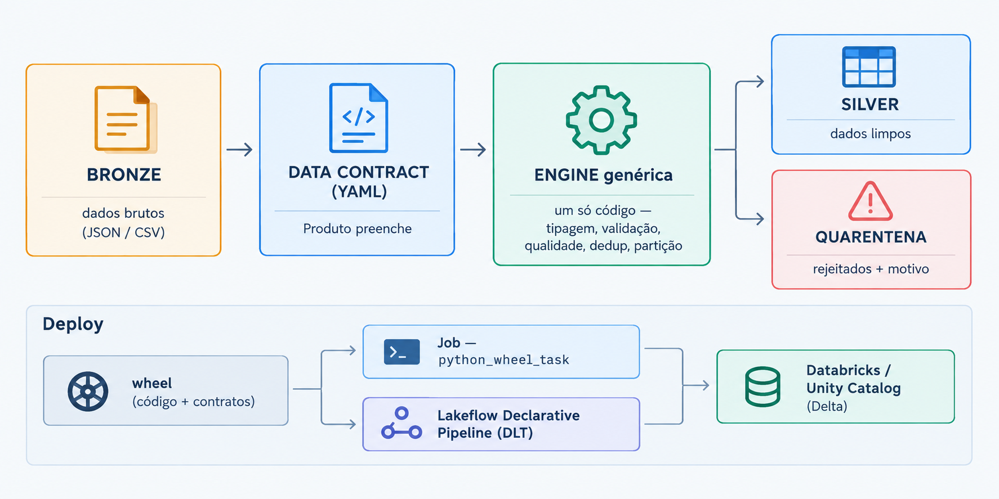

# Pipeline Silver dirigida por Data Contract

Ingestão Bronze → Silver de uma plataforma de pagamentos, onde **uma engine
genérica lê o contrato de dados e aplica tipagem, validação, qualidade,
deduplicação e particionamento automaticamente**. O time de Produto/Dev só
preenche o YAML do contrato; nenhuma regra é escrita por fonte.



Código e contratos são empacotados numa **wheel** e implantados via **Databricks
Asset Bundle** por dois caminhos que usam a mesma wheel: um **Job** (`python_wheel_task`,
engine imperativa) e um **Lakeflow Declarative Pipeline** (DLT), em que as regras do
contrato viram expectations. O artefato (código + contratos) viaja versionado como
uma unidade.

## Estrutura

```
src/silver_pipeline/
  contract.py          modelo Pydantic do contrato (valida o contrato no load)
  quality.py           funções puras: CPF, e-mail, timestamp, score, valor
  engine.py            prepare() (lê → transforma → tipa) + refine() (quarentena → dedup
                       → regras → derivadas); write_output(); regras → expectations
  pipeline.py          entry point `silver-pipeline` do job (main)
  dlt_pipeline.py      caminho declarativo (Lakeflow/DLT) sobre os mesmos contratos
  contracts/*.yaml     os 3 contratos, EMBUTIDOS no pacote
tests/                 test_quality (puros) + test_engine (Spark)
resources/
  silver_pipeline.job.yml       job do Databricks Asset Bundle
  silver_pipeline.pipeline.yml  pipeline declarativo (serverless)
databricks.yml         bundle (variáveis, artifacts=wheel, targets)
data/bronze/*          dados de exemplo (para rodar local e/ou subir a um Volume)
docs/fluxo.png         diagrama do fluxo
```

Fluxo da engine, por dataset: leitura (adapter por formato) → transformações
declaradas → cast de tipo (`prepare`) → **regras hard** (PK nula / `nullable:false` →
quarentena) → dedup pela chave → **regras soft** (política `on_fail`) → derivadas
(`refine`) → escrita (`write_output`, só no job; no DLT quem materializa é o pipeline).

## Como rodar

### Databricks (via Asset Bundle — caminho principal)

Pré-requisitos: Databricks CLI instalada e permissão de escrita no schema Silver.
Os defaults das variáveis são genéricos (`main.silver` e `/Volumes/main/bronze/payments`):
ajuste `silver_schema` / `bronze_volume` em `databricks.yml` para o seu catálogo (ou
sobrescreva com `--var`), e o `host` dos targets para o seu workspace.

```bash
# 1. autenticar (ou usar um profile existente via DATABRICKS_CONFIG_PROFILE)
databricks auth login --host <seu-workspace>

# 2. criar schemas + volume e subir os 3 arquivos Bronze (nomes exatos)
#    SQL: CREATE SCHEMA IF NOT EXISTS <catalog>.bronze;
#         CREATE SCHEMA IF NOT EXISTS <catalog>.silver;
#         CREATE VOLUME IF NOT EXISTS <catalog>.bronze.payments;
databricks fs cp data/bronze/transactions.json dbfs:/Volumes/<catalog>/bronze/payments/transactions.json
databricks fs cp data/bronze/customers.csv     dbfs:/Volumes/<catalog>/bronze/payments/customers.csv
databricks fs cp data/bronze/fraud_flags.json  dbfs:/Volumes/<catalog>/bronze/payments/fraud_flags.json

# 3. validar, implantar e rodar
databricks bundle validate
databricks bundle deploy -t dev          # builda a wheel e sobe o job + o pipeline DLT
databricks bundle run silver_pipeline -t dev
```

O bundle constrói `dist/*.whl` (artifact `type: whl`), instala no cluster do job
e roda o entry point `silver-pipeline` com `--output ${silver_schema}` e
`--source-base ${bronze_volume}`. Saída: tabelas gerenciadas **Delta** no Unity
Catalog `⟨schema⟩.transactions_silver` (+ `_quarantine`), idem customers e fraud.

### Databricks (Spark Declarative Pipeline / DLT — caminho declarativo paralelo)

Item 6 do desafio. É um **segundo caminho**, paralelo ao job acima (engine
imperativa): o mesmo contrato YAML e as mesmas etapas da engine, mas orquestrados
por um **Spark Declarative Pipeline (Lakeflow Spark Declarative Pipelines, o nome atual
do DLT)**. Nenhuma regra é reescrita à mão: o contrato continua sendo a única fonte de
verdade.

> **Por que não há `import dlt`:** o código usa a API atual, `from pyspark import
> pipelines as dp`, que a Databricks recomenda no lugar do módulo `dlt` (ainda
> suportado, mas legado). Os decorators são os equivalentes diretos:
> `@dp.materialized_view` / `@dp.temporary_view` (antes `@dlt.table` / `@dlt.view`),
> `@dp.expect_all_or_drop` e `@dp.expect_all`.

`src/silver_pipeline/dlt_pipeline.py` gera, para cada contrato embutido:

| Dataset | Tipo | O que faz |
|---|---|---|
| `<nome>_bronze` | view | lê a fonte do contrato (formato/opções) no `bronze_volume` |
| `<nome>_typed` | view | `engine.prepare` (transform + cast); PK e `nullable:false` viram `@dp.expect_all_or_drop` |
| `<nome>` | materialized view | `engine.refine` (dedup + regras soft + derivadas, particionada como no contrato); regras soft viram `@dp.expect_all` (warn) sobre `_dq_flags` |
| `<nome>_quarantine` | materialized view | linhas rejeitadas com `_quarantine_reason`, igual à quarentena do job |

As expectations são geradas a partir do contrato (`hard_expectations` /
`soft_expectations` em `engine.py`), então as métricas de qualidade e a linhagem
Bronze → Silver aparecem no grafo do pipeline.

Publica em `<silver_catalog>.<silver_dlt_schema>` (default `main.silver_dlt`), um
schema **separado** das tabelas do job: um pipeline não publica sobre tabelas que ele
não gerencia. Pré-requisito, além do Volume Bronze da seção anterior:

```sql
CREATE SCHEMA IF NOT EXISTS <catalog>.silver_dlt;
```

```bash
databricks bundle deploy -t dev --var="silver_catalog=<catalog>" \
  --var="bronze_volume=/Volumes/<catalog>/bronze/payments"   # sobe job + pipeline
databricks bundle run silver_dlt -t dev --var="silver_catalog=<catalog>" \
  --var="bronze_volume=/Volumes/<catalog>/bronze/payments"   # roda o pipeline
```

O pipeline é serverless e instala a mesma wheel do job (`environment.dependencies`),
então engine e contratos vêm do mesmo artefato versionado.

### Local (Spark + Java 17)

```bash
pip install -e ".[dev]"                   # pacote + pyspark/delta/pytest/ruff
pytest -q                                 # 32 testes (funções puras + engine)
silver-pipeline                           # usa contratos embutidos, grava data/silver/*
# ou: python -m silver_pipeline.pipeline --output data/silver
```

O **mesmo código** serve aos dois ambientes:
- `--output` com `catalog.schema` → tabelas gerenciadas Delta (`saveAsTable`); com um
  diretório → arquivos por path (Delta no cluster, Parquet local).
- `--source-base` reancora as fontes num Volume mantendo os nomes; sem ele usa os
  paths dos contratos (`data/bronze/...`).
- Delta é detectado pelo runtime Databricks (nativo), não por config frágil de sessão.
- No cluster a wheel torna `silver_pipeline` importável nos executors (UDFs), sem gambiarra.

Saída de referência (dados fornecidos):

```
[customers_silver]    validas=10 quarentena=0
[fraud_flags_silver]  validas=11 quarentena=0
[transactions_silver] validas=12 quarentena=2   (PK nula + amount 'INVALIDO'; 1 duplicata removida)
```

## Decisões técnicas

**Engine dirigida por contrato (não 3 scripts).** O enunciado pede abstrair a ingestão
*atrás do contrato*. Uma 4ª fonte não custa código — custa um YAML. O contrato é
validado por Pydantic no load: contrato malformado falha cedo, não em runtime.

**Wheel + contratos embutidos.** O artefato entregue é code + contratos juntos,
versionados (`version` no pyproject e em cada contrato). O `python_wheel_task` instala
a wheel no cluster; `pyspark`/`delta` são nativos do runtime, então a wheel só carrega
`pydantic` + `PyYAML`.

**Funções puras + UDF.** Regras (CPF, escala de score, valor) são funções puras,
testadas sem JVM (rápido, determinístico) e reusadas via UDF. Para escala, trocar por
`pandas_udf`/expressão nativa não muda contrato nem teste (assinatura escalar→escalar).

**Quarentena, não descarte.** Violação hard (PK nula, tipo obrigatório não-parseável)
vai para `⟨tabela⟩_quarantine` com `_quarantine_reason`. Permite auditoria e reprocesso.

**Política `on_fail` por regra soft** (`quarantine`/`nullify`/`warn`): o contrato decide
o rigor sem tocar na engine.

**Silver ≠ Gold.** A tabela enriquecida (transação × cliente × fraude) é Gold, não
Silver, e ficou de fora de propósito: a Silver é a fonte conformada por entidade, e o
join cruzado é responsabilidade da camada seguinte.

**Dois caminhos, um contrato.** O job (engine imperativa) e o pipeline declarativo
chamam as mesmas etapas da engine (`prepare`/`refine`) e produzem as mesmas linhas;
no DLT, as regras do contrato também aparecem como expectations, com métricas de
qualidade e linhagem no grafo. Publicam em schemas separados (`silver` e `silver_dlt`).

**Decisões aterradas nos dados reais (explorados antes de codar):**

- **CPF** — os 10 CPFs do arquivo **reprovam** o dígito verificador (dados fake). Por isso
  `valid_cpf` usa `on_fail: nullify`: anula o valor e sinaliza em `_dq_flags`, **sem
  descartar o cliente**. `quarantine` aqui zeraria a base.
- **E-mail duplicado** (1001 e 1006, clientes distintos) — dedup de clientes é por
  `customer_id`, **nunca por e-mail**, senão perderia um cliente legítimo. Duplicidade e
  e-mail malformado (`roberto@email`) são **sinalizados** em `_dq_flags`.
- **`transaction_id` duplicado** (`...440001`) — é a PK real: dedup `keep=last` por
  `transaction_date` mantém o evento mais recente e torna a carga idempotente.
- **Timestamp em 2 formatos** (`...Z` e `yyyy-MM-dd HH:mm:ss`) — `parse_timestamp` tenta a
  lista de formatos do contrato via `coalesce`.
- **`fraud_score` em escalas diferentes** (float 0–1 e `"MEDIUM"`) — `normalize_score`
  mapeia categórico→numérico via `score_map` e faz clamp em [0,1].
- **`transaction_amount`** string/número com `"INVALIDO"` — `clean_numeric` normaliza
  (milhar/decimal BR); não-parseável em coluna `nullable:false` → quarentena.

## Edge cases tratados

Timestamp malformado/multi-formato · valor não-numérico · PK nula · duplicata de PK ·
e-mail duplicado e malformado · CPF sem máscara e com dígito inválido · score categórico ·
campos nulos opcionais · fonte esparsa (fraud não cobre todas as transações; cada
entidade vira sua própria Silver, sem join). Data futura (`2025-03-15`) é preservada e
observável via `transaction_date_ref` (não há regra de range de datas no contrato).

## Testes

`tests/test_quality.py` — 27 testes das transformações puras (parametrizados).
`tests/test_engine.py` — 5 testes de integração rodando Spark sobre os dados reais: os
edge cases exigidos, a flag `invalid_cpf` gravada junto com o CPF anulado (`nullify`) e a
detecção de destino (pulam se pyspark ausente). Total: 32. `ruff` no lint.

## Diferenciais incluídos

- **CI/CD** — `.github/workflows/ci.yml`: lint (ruff) + pytest + **build da wheel** a cada
  push na `main` e a cada PR.
- **Databricks Asset Bundle** — `databricks.yml` + `resources/silver_pipeline.job.yml`:
  wheel como artifact, `python_wheel_task`, cluster UC, schedule (pausado); deploy
  reproduzível.
- **Spark Declarative Pipeline (Lakeflow/DLT)** — `resources/silver_pipeline.pipeline.yml`
  + `src/silver_pipeline/dlt_pipeline.py`: pipeline serverless com a mesma wheel; os
  mesmos contratos viram expectations.
